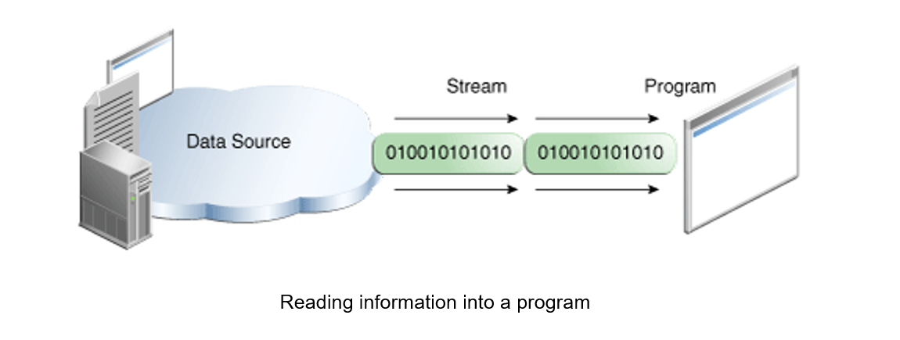
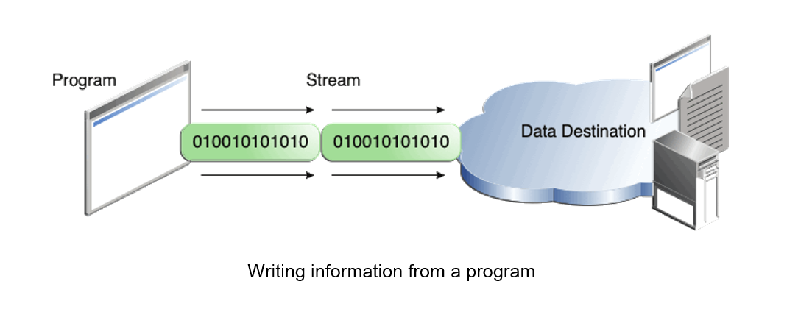
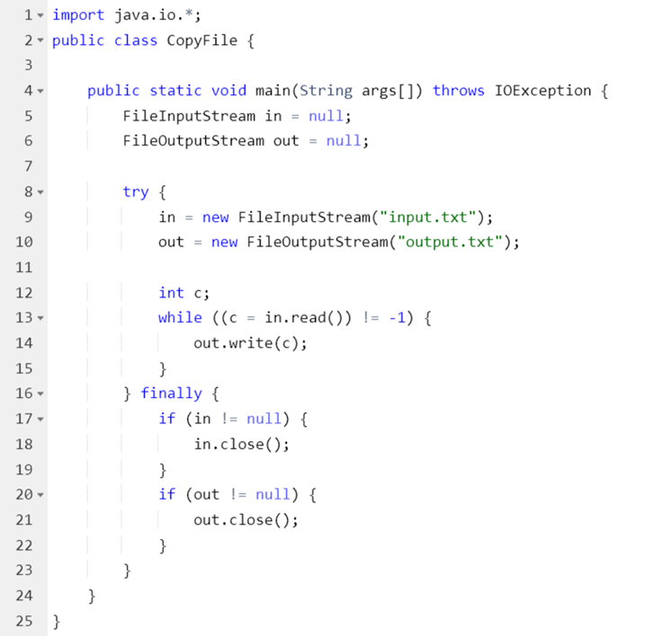
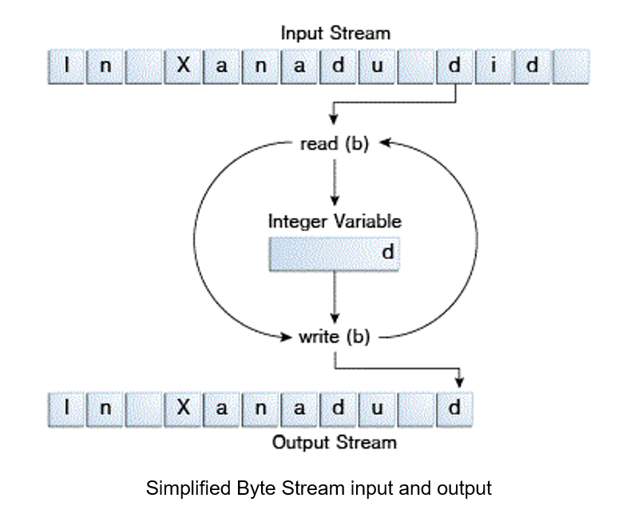
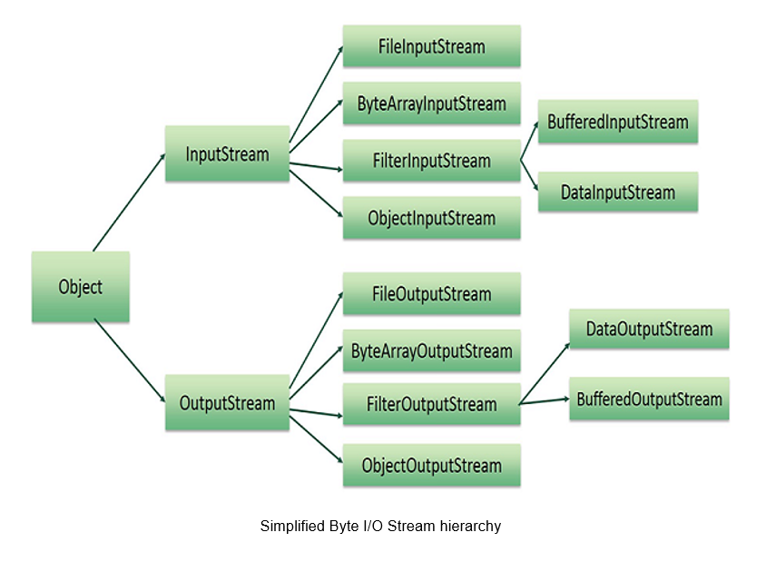
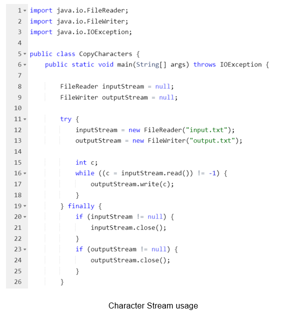
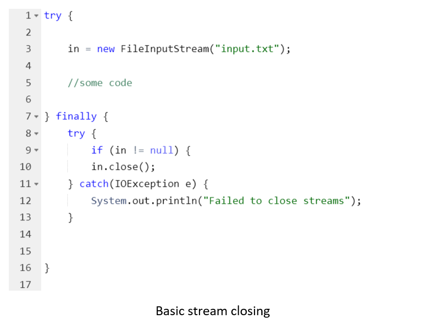
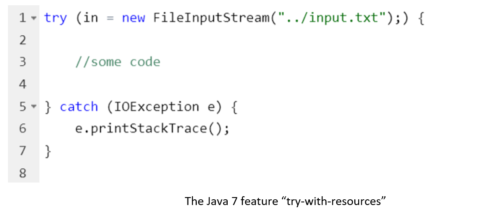
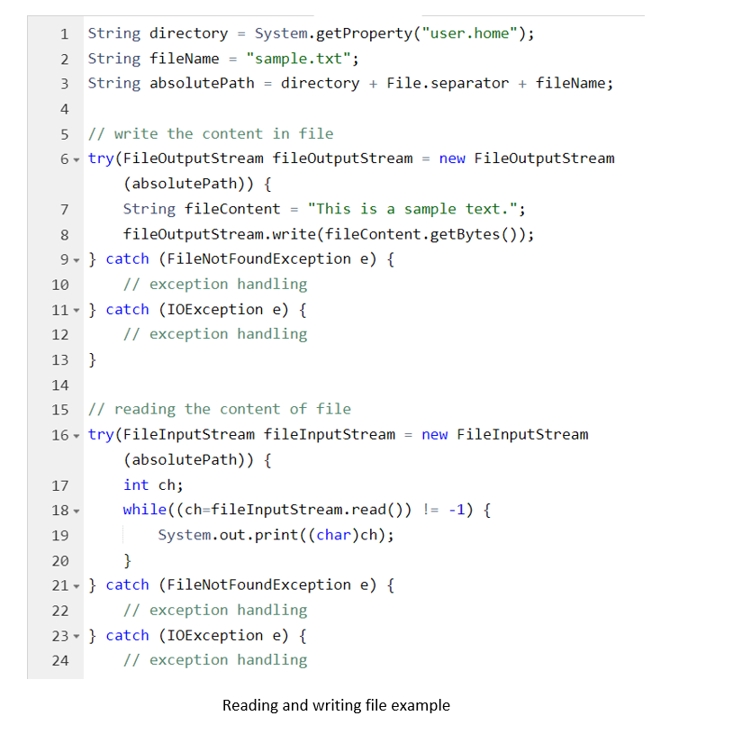

# Java I/O (java.io)

## Introduction to IO

Java I/O (Input and Output) is used to process the input and produce the output.
Java uses the concept of a stream to make I/O operation fast. The java.io package contains all the classes 
required for input and output operations. 

We can perform **file handling in Java** by Java I/O API.

## Java I/O Streams. What is a Stream?

A **stream** is an ordered sequence of bytes of indeterminate length. 
A stream can represent many kinds of sources and destinations, including disk files, devices, other programs, and memory arrays. 
In other words, we can imagine streams as water pipelines, data as water, source/target as well/end-user.

Java I/O Streams support many kinds of data, including simple bytes, primitive data types, localized characters, and objects. Some streams simply pass on data;
others manipulate and transform the data in useful ways

- [Byte Streams](https://docs.oracle.com/javase/tutorial/essential/io/bytestreams.html) handle I/O of raw binary data.
- [Character Streams](https://docs.oracle.com/javase/tutorial/essential/io/charstreams.html) handle I/O of character data, automatically handling translation to and from the local character set.
- [Buffered Streams](https://docs.oracle.com/javase/tutorial/essential/io/buffers.html) optimize input and output by reducing the number of calls to the native API.
- [Scanning and Formatting](https://docs.oracle.com/javase/tutorial/essential/io/scanfor.html) allows a program to read and write formatted text.
- [I/O from the Command Line](https://docs.oracle.com/javase/tutorial/essential/io/cl.html) describes the Standard Streams and the Console object.
- [Data Streams](https://docs.oracle.com/javase/tutorial/essential/io/datastreams.html) handle binary I/O of primitive data type and String values.
- [Object Streams](https://docs.oracle.com/javase/tutorial/essential/io/objectstreams.html) handle binary I/O of objects.

No matter how they work internally, all streams present the same simple model to programs that use them: A stream is a sequence of data. A program uses an *input stream* to read data from a source, one item at a time:

A program uses an *output stream* to write data to a destination, one item at time:

## Byte Streams

Programs use *byte streams* to perform input and output of 8-bit bytes. All byte stream classes are descended from [InputStream](https://docs.oracle.com/javase/8/docs/api/java/io/InputStream.html) and [OutputStream](https://docs.oracle.com/javase/8/docs/api/java/io/OutputStream.html).
There are many byte stream classes. To demonstrate how byte streams work, we'll focus on the file I/O byte streams, [FileInputStream](https://docs.oracle.com/javase/8/docs/api/java/io/FileInputStream.html) and [FileOutputStream](https://docs.oracle.com/javase/8/docs/api/java/io/FileOutputStream.html) which read and write files. Other kinds of byte streams are used in much the same way; they differ mainly in the way they are constructed.

Following is an example which makes use of these two classes to copy an input file into an output file using byte stream, one byte at a time:

|  |
|-------------------------|
| Byte Stream usage       |

*CopyFile* spends most of its time in a simple loop that reads the input stream and writes the output stream, one byte at a time, as shown in the following figure.

Method “read()” reads one element and return it’s value. When operation read is ended, then returned “-1”. Method “write(c)” writes one element into file.
You can read about other Byte Streams [here](https://www.javatpoint.com/bytestream-classes-in-java).

## Character Streams

The Java platform stores character values using Unicode conventions. Character stream I/O automatically translates this internal format to and from the local character set. In Western locales, the local character set is usually
an 8-bit superset of ASCII.

For most applications, I/O with character streams is no more complicated than I/O with byte streams. 
Input and output done with stream classes automatically translates to and from the local character set. 
A program that uses character streams in place of byte streams automatically adapts to the local character set and 
ready for internationalization — all without extra effort by the programmer.

Character streams are often "wrappers" for byte streams. 
The character stream uses the byte stream to perform the physical I/O, 
while the character stream handles translation between characters and bytes. *FileReader*, for example,
uses *FileInputStream*, while *FileWriter* uses *FileOutputStream*. The major difference is that *FileReader* reads two bytes at one time and *FileWriter* writes two bytes at one time. 
Therefore, previous program could be simply rewritten by replacing *FileOutputStream* on *FileWriter*  and *FileInputStream* on *FileReader*.

There are two general-purpose byte-to-character "bridge" streams: [InputStreamReader](https://docs.oracle.com/javase/8/docs/api/java/io/InputStreamReader.html) and [OutputStreamWriter](https://docs.oracle.com/javase/8/docs/api/java/io/InputStreamReader.html). 
Use them to create character streams when there are no prepackaged character stream classes that meet your needs.

## Closing

Unfortunately, Java machine doesn’t close streams automatically, therefore every IO stream should be closed manually. 
If we forget to close the stream, the channel will remain open and then we would end up with a resource leak. 
There are two main options how to close streams: basic in finally block and Java 7 feature try-with-resources. 
Let’s improve our code and close streams in appropriate way:

We should place stream closing in finally block, because if anything goes wrong in try section, stream anyway should be closed.

Using the new Java 7 feature "try-with-resources" is the second(and recommended) option:

## Exceptions
In this section will be given short description of common exceptions for I/O:
- IOException – basic IO exception
- FileNotFoundException – file not found
- EOFException – signals that an end of file or end of stream has been reached unexpectedly during input
- UnsupportedEncodingException – encoding is not supported.

Usually, all exceptions above are caught with IOException.

## Java.io.File

The **File** class is Java’s representation of a file or directory **pathname**. 
Because file and directory names have different formats on different platforms, a simple string is not adequate to name them. 
The File class contains several methods for working with the pathname, deleting and renaming files, creating new directories, 
listing the contents of a directory, and determining several common attributes of files and directories. 

- It is an abstract representation of files and directory pathnames.
- A pathname, whether abstract or in string form can be either absolute or relative. The parent of an abstract pathname may be obtained by invoking the getParent() method of this class.
- First of all, we should create the File class object by passing the filename or directory name to it. A file system may implement restrictions to certain operations on the actual file-system object, such as reading, writing, and executing. These restrictions are collectively known as access permissions.
- Instances of the File class are immutable; that is, once created, the abstract pathname represented by a File object will never change.

Constructors of File Class:

- File(File parent, String child): Creates a new File instance from a parent abstract pathname and a child pathname string.
- File(String pathname): Creates a new File instance by converting the given pathname string into an abstract pathname.
- File(String parent, String child): Creates a new File instance from a parent pathname string and a child pathname string.
- File(URI uri): Creates a new File instance by converting the given file: URI into an abstract pathname.

One of the ways how to read and write files with Java I/O:

## Useful links

- [Java - Files and I/O (tutorialspoint.com)](https://www.tutorialspoint.com/java/java_files_io.htm)
- [I/O Streams (The Java™ Tutorials > Essential Java Classes > Basic I/O) (oracle.com)](https://docs.oracle.com/javase/tutorial/essential/io/streams.html)
- [Lesson: Basic I/O (The Java™ Tutorials > Essential Java Classes) (oracle.com)](https://docs.oracle.com/javase/tutorial/essential/io/)
- [ByteStream Classes in Java - Javatpoint](https://www.javatpoint.com/bytestream-classes-in-java)
- [Java.io.File Class in Java - GeeksforGeeks](https://www.geeksforgeeks.org/file-class-in-java/)
- [Reading and Writing Files in Java (stackabuse.com)](https://stackabuse.com/reading-and-writing-files-in-java/)

##
